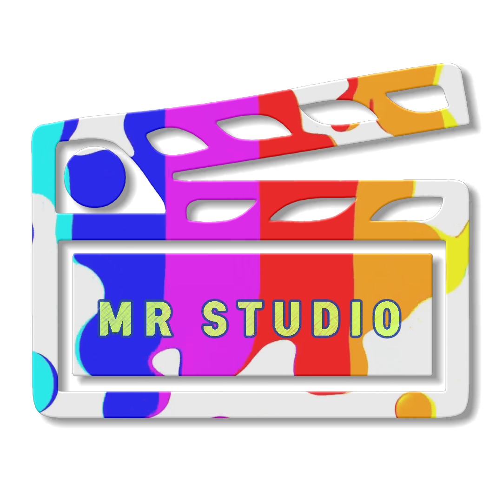
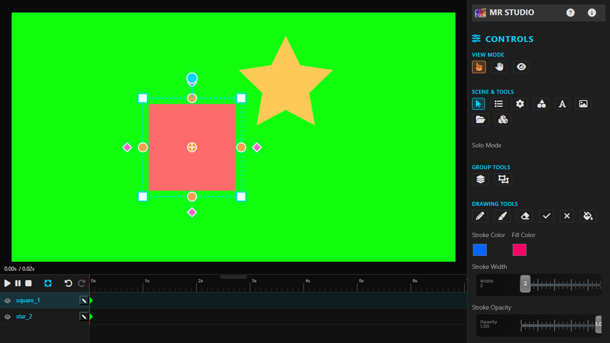
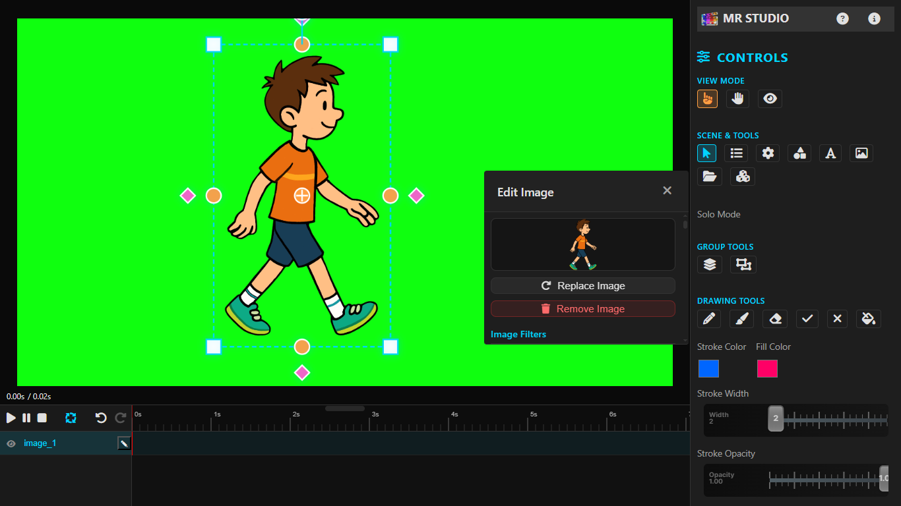
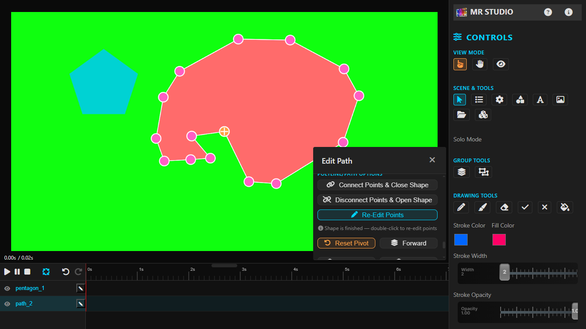
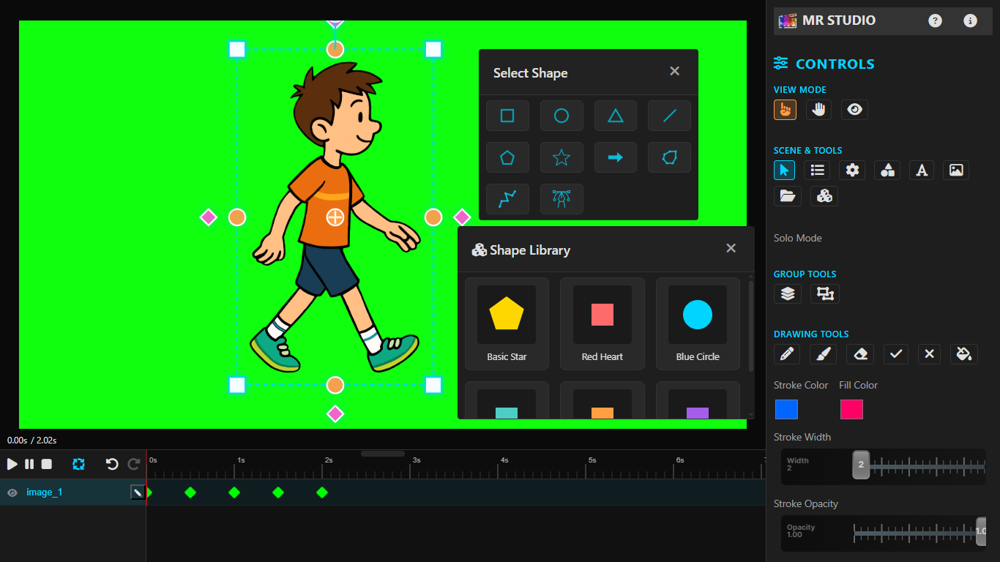
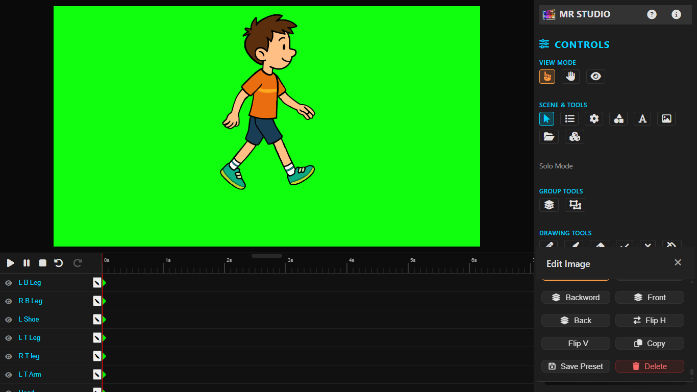

<div align="center">

# 🎨 MR Studio

### Professional Web-Based 2D Javascript Animation Software

[](LICENSE)
[](https://github.com/MRaheem99/mr-studio/stargazers)
[](https://github.com/MRaheem99/mr-studio/network)
[](https://github.com/MRaheem99/mr-studio/issues)
[](https://developer.mozilla.org/en-US/docs/Web/JavaScript)

**A powerful, lightweight, web-based javascript 2D animation software for YouTubers, animation channels, and content creators**



**Live Demo:** [https://MRaheem99.github.io/mr-studio](https://MRaheem99.github.io/mr-studio)

</div>

---

## 📖 About MR Studio

**MR Studio** is a **powerful animation software** built with **JavaScript** that runs entirely in your browser. It's a **lightweight**, **web-based 2D animation software** designed specifically for **YouTubers**, **animation channels**, and content creators who need to create stunning **YouTube videos** without expensive software.

Whether you are creating explainer videos, animated intros, or full-length **YouTube videos**, MR Studio provides professional-grade tools in a lightweight package that runs on any device with a browser.

### 🎯 Perfect for:
- ✅ **YouTubers** creating animated content
- ✅ **Animation channels** producing regular videos
- ✅ **Content creators** making explainer videos
- ✅ **Teachers** creating educational animations
- ✅ **Marketers** producing promotional videos
- ✅ **Hobbyists** learning animation

---

## ✨ Key Features

### 🎯 Powerful Selection & Transformation
- **Multi-Selection** - Select multiple objects with Shift/Ctrl+Click
- **Marquee Selection** - Drag to select multiple objects
- **Grouping** - Group objects together and transform as one
- **Transform Handles** - Move, scale, rotate, skew with intuitive handles

### ✏️ Professional Drawing Tools
- **9 Brush Types** - Solid, Tapered, Dotted, Dashed, Wavy, Zigzag, Glow, Gradient, Texture
- **Stroke Stabilization** - Smooth out shaky hand movements
- **Stroke Hardness** - Control edge softness
- **Eraser Tool** - Erase portions of drawings
- **Fill Bucket** - Fill closed shapes with color

### 🎬 Complete Animation System
- **Keyframe Animation** - Professional keyframe timeline
- **12 Easing Types** - Linear, Ease In/Out, Bounce, Elastic, and more
- **Smooth Interpolation** - Automatic frame interpolation
- **Group Animation** - Animate entire groups as one unit
- **Loop Playback** - Perfect for YouTube video intros and outros

### 🖌️ Extensive Shape Library
- **Basic Shapes** - Square, Circle, Triangle, Line
- **Polygons** - Pentagon, Star, Arrow, Custom Polygon
- **Paths** - Bezier curves and paths
- **Text** - Add and style text with multiple fonts
- **Images** - Import and manipulate images

### 🎨 Professional Styling
- **Fill Colors** - Solid colors and gradients
- **Border Controls** - Width, color, offset, blur
- **Shadow Effects** - Professional drop shadows
- **Opacity** - Transparency control
- **Image Filters** - Brightness, contrast, saturation, blur

### 📦 Export for YouTube & Social Media
| Format | Best For |
|--------|----------|
| **WebM** | YouTube videos, high-quality exports |
| **GIF** | Social media, previews, memes |
| **PNG Sequence** | Frame-by-frame editing |
| **JSON** | Save/load projects |

---

## 📸 See MR Studio in Action

### Main Interface


### Creating YouTube Video Intros


### Drawing Tools for Content Creators


### Keyframe Animation Timeline


### Export for YouTube Videos


---

## 🚀 Quick Start for YouTubers

### Installation (Takes 30 Seconds!)

```bash
# Clone the repository
git clone https://github.com/MRaheem99/mr-studio.git

# Navigate to folder
cd mr-studio

# Open index.html in your browser
# That's it! No installation needed!
---

## 📖 About

MR Studio is a powerful free web-based javascript animation software, browser-based animation tool that combines vector drawing, keyframe animation, and professional export features. Create stunning animations, create cartoon animations, create animation videos for Youtube channel, draw freehand with multiple brush types, group objects, add keyframes with easing, and export to video or GIF - all without installing any software.

Whether you are a professional animator, Youtuber, creating animation for Youtube channel, motion graphics designer, or hobbyist, MR Studio provides the tools you need to bring your ideas to life.

---

## ✨ Features

### 🎯 Selection & Transformation
- **Multi-Selection** - Select multiple objects with Shift/Ctrl+Click
- **Marquee Selection** - Drag to select multiple objects
- **Grouping** - Group objects together and transform as one
- **Transform Handles** - Move, scale, rotate, skew with intuitive handles
- **Pivot Point** - Change rotation center for advanced animations

### ✏️ Drawing Tools
- **9 Brush Types** - Solid, Tapered, Dotted, Dashed, Wavy, Zigzag, Glow, Gradient, Texture
- **Stroke Stabilization** - Smooth out shaky hand movements
- **Stroke Hardness** - Control edge softness from hard to soft
- **Eraser Tool** - Erase portions of drawings
- **Fill Bucket** - Fill closed shapes with color
- **Path Editing** - Edit bezier curves with control handles

### 🎬 Animation System
- **Keyframe Animation** - Add keyframes on timeline
- **12 Easing Types** - Linear, Ease In/Out, Bounce, Elastic, and more
- **Smooth Interpolation** - Automatic frame interpolation
- **Group Animation** - Animate entire groups as one unit
- **Real-time Preview** - See animation as you create it

### 🖌️ Shape Library
- **Basic Shapes** - Square, Circle, Triangle, Line
- **Polygons** - Pentagon, Star, Arrow, Custom Polygon
- **Paths** - Bezier curves and paths
- **Text** - Add and style text
- **Images** - Import and manipulate images
- **Free Drawing** - Convert drawings to vector shapes

### 🎨 Styling Options
- **Fill Colors** - Solid colors and gradients
- **Border Controls** - Width, color, offset, blur
- **Shadow Effects** - Blur, offset, opacity
- **Opacity** - Transparency control
- **Image Filters** - Brightness, contrast, saturation, blur

### 📦 Export Formats

| Format | Description |
|--------|-------------|
| **WebM** | High-quality video with transparency support |
| **GIF** | Animated GIF for easy sharing |
| **PNG Sequence** | Export each frame as PNG (ZIP archive) |
| **JSON** | Save/load project files for later editing |

---

## ⌨️ Keyboard Shortcuts

### Selection & Transform

| Shortcut | Action |
|----------|--------|
| `Arrow Keys` | Move selected object by 1px |
| `Shift + Arrow Keys` | Move selected object by 10px |
| `Ctrl + Arrow Keys` | Rotate by 5° |
| `Ctrl + Shift + Arrow Keys` | Rotate by 15° |
| `Delete / Del` | Delete selected object(s) |
| `Ctrl + A` | Select all objects |
| `Escape` | Clear selection |

### Edit Operations

| Shortcut | Action |
|----------|--------|
| `Ctrl + C` | Copy selected object(s) |
| `Ctrl + V` | Paste copied object(s) |
| `Ctrl + X` | Cut selected object(s) |
| `Ctrl + D` | Duplicate selected object(s) |
| `Ctrl + E` | Open Edit Properties modal |
| `Ctrl + Z` | Undo |
| `Ctrl + Y / Ctrl + Shift + Z` | Redo |

### Layer Order

| Shortcut | Action |
|----------|--------|
| `Ctrl + ]` | Bring Forward (one step) |
| `Ctrl + [` | Send Backward (one step) |
| `Ctrl + Shift + ]` | Bring to Front |
| `Ctrl + Shift + [` | Send to Back |

### Object Transform

| Shortcut | Action |
|----------|--------|
| `Ctrl + L` | Lock/Unlock object |
| `Ctrl + H` | Hide/Show object |
| `Ctrl + Shift + C` | Center object on canvas |
| `Ctrl + R` | Reset transform |
| `Ctrl + Shift + H` | Flip Horizontal |
| `Ctrl + Shift + V` | Flip Vertical |

### Drawing Tools

| Shortcut | Action |
|----------|--------|
| `P` | Pencil tool |
| `B` | Brush tool |
| `E` | Eraser tool |
| `F` | Finish drawing |
| `V` | Object mode (Select) |
| `H` | Canvas mode (Pan) |

### Shape & Text

| Shortcut | Action |
|----------|--------|
| `N` | Add new shape |
| `T` | Add text |
| `I` | Import image |

### Group Operations

| Shortcut | Action |
|----------|--------|
| `Ctrl + G` | Group selected objects |
| `Ctrl + Shift + G` | Ungroup selected group |

### Animation Playback

| Shortcut | Action |
|----------|--------|
| `Space` | Play/Pause animation |
| `Home` | Go to start of animation |
| `End` | Go to end of animation |

### File Operations

| Shortcut | Action |
|----------|--------|
| `Ctrl + O` | Import project |
| `Ctrl + Shift + E` | Open Export dialog |
| `Ctrl + Shift + N` | New Project |

### View Controls (Canvas Mode)

| Shortcut | Action |
|----------|--------|
| `Ctrl + Wheel` | Zoom In/Out |
| `Ctrl + + / Ctrl + =` | Zoom in |
| `Ctrl + -` | Zoom out |
| `Ctrl + 0` | Reset zoom |
| `F11 / Ctrl + Shift + F` | Fullscreen preview |

---

## 🚀 Quick Start

### Installation

```bash
# Clone the repository
git clone https://github.com/MRaheem99/mr-studio.git

# Navigate to project folder
cd mr-studio

# Open index.html in your browser
# Or use a local server
python -m http.server 8000
# Then visit http://localhost:8000


Your First Animation
Create a shape - Click "Add Shape" or press N

Add keyframes - Click on the timeline at different times

Transform the shape - Move, scale, or rotate using handles

Play animation - Press Space to watch your animation

Drawing with Brushes
Select Brush - Press B or click the Brush button

Choose brush type - Select from 9 different brush styles

Adjust settings - Set stroke width, color, opacity, hardness

Draw - Click and drag on canvas

Finish - Click "Finish Drawing" to convert to shape

Working with Groups
Select multiple objects - Ctrl+Click or marquee selection

Group - Press Ctrl+G to group

Transform group - Use handles to transform entire group

Ungroup - Select group and press Ctrl+Shift+G


### 🛠️ Technology Stack
Technology	Purpose
HTML5 Canvas	Rendering engine
Vanilla JavaScript	Core logic (no frameworks)
CSS3	Styling and UI
Canvas API	Drawing and transformations
MediaRecorder API	Video export
JSZip	PNG sequence export
gif.js	GIF export


### 📁 Project Structure
mr-studio/
├── index.html              # Main entry point
├── css/
│   └── styles.css          # Global styles
├── js/
│   ├── globals.js          # Global variables
│   ├── shape.js            # Shape class
│   ├── group.js            # Group class
│   ├── animator.js         # Animation engine
│   ├── operator.js         # Main orchestration
│   ├── shape-manager.js    # Property management
│   ├── undo-manager.js     # Undo/redo system
│   ├── tracks.js           # Timeline tracks
│   ├── freeDrawingTools.js # Drawing tools
│   ├── advanced-export.js  # Export functionality
│   ├── fill-bucket.js      # Fill bucket tool
│   ├── shortcuts.js        # Keyboard shortcuts
│   └── lib/
│       ├── gif.js          # GIF encoder
│       └── gif.worker.js   # GIF worker
├── img/
│   └── icons/              # Shape icons
└── README.md


### 🎯 Use Cases
Motion Graphics - Create animated logos and titles

Explainers - Animated whiteboard-style videos

Social Media - GIFs and short animations

Game Assets - Animated sprites and effects

UI Prototypes - Animated interface concepts

Educational - Teaching animation principles


### 🔧 Browser Support
Browser	Version
Chrome	90+
Firefox	88+
Safari	14+
Edge	90+


### 🤝 Contributing
Contributions are welcome! Please feel free to submit a Pull Request.

Fork the repository

Create your feature branch (git checkout -b feature/AmazingFeature)

Commit your changes (git commit -m 'Add some AmazingFeature')

Push to the branch (git push origin feature/AmazingFeature)

Open a Pull Request


Development Guidelines
Use 4 spaces for indentation

Use camelCase for variables and functions

Use PascalCase for classes

Add comments for complex logic

Test in multiple browsers


### 📝 License
Distributed under the MIT License. See LICENSE file for more information.


### 🙏 Acknowledgments
Font Awesome - Icons

gif.js - GIF export

JSZip - PNG sequence export

Google Fonts - Typography


### 📧 Contact
mraheem764@gmail.com

Project Link: https://github.com/MRaheem99/mr-studio


### ⭐ Show Your Support
If you found this project helpful, please give it a star on GitHub!

https://img.shields.io/github/stars/MRaheem99/mr-studio


### Made with ❤️ by M. Raheem
